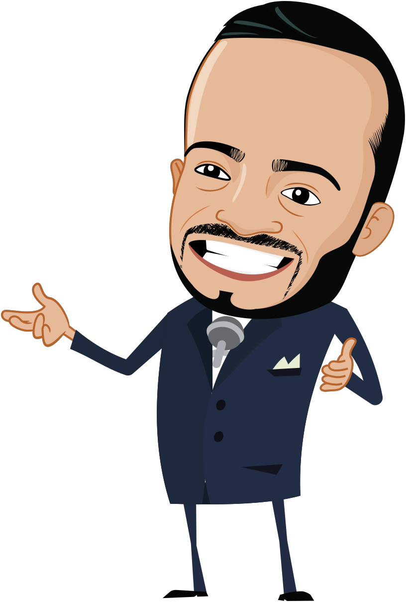

<a id="readme-top"></a>


<div align="left">
  <h3>SHOW do FSC - Quiz (React + Vite + Pixi.js)</h3>
  <p>Um quiz inspirado no <strong>Show do Milhão</strong>, desenvolvido em <strong>React</strong> + <strong>TypeScript</strong> + <strong>Vite</strong>, com avatar em <strong>Pixi.js v8</strong> e dados armazenados no <strong>LocalStorage</strong>.  
  As perguntas são carregadas dinamicamente conforme categoria e nível de dificuldade.</p>
</div>


---

### 📂 Estrutura

src/
├─ assets/ → Imagens e logo
├─ components/ → Telas e componentes (Loading, Menu, Game, Avatar etc.)
├─ data/
│ ├─ manisfest.json → Contém categorias e levels
│ └─ questions/{categoria}/{nível}.json
├─ hooks/ → Hooks personalizados (useLocalStorage)
├─ utils/ → Funções utilitárias (ex: shuffleArray)
├─ App.tsx → Controle de rotas/telas
├─ main.tsx → Ponto de entrada
└─ index.css → Estilos globais

---

### ⚙️ Funcionalidades

- Tela de **loading animado**
- Tela de **aceite de termos**
- **Menu principal** com navegação inferior
- Tela de **jogo com timer, avatar e perguntas**
- Telas de **vitória e derrota**
- **Pontuação salva no LocalStorage**
- **Carregamento dinâmico** das perguntas (`import()`)

---

### 🧩 Tecnologias

- React + TypeScript + Vite
- Pixi.js v8
- LocalStorage
- SASS/Tailwind (opcional)

---

### 🚀 Rodando o projeto

```bash
npm install
npm run dev

Acesse em:
👉 http://localhost:5173

➕ Como adicionar novas perguntas

Crie um novo diretório em src/data/questions/{categoria}/

Adicione os arquivos:

easy.json
medium.json
hard.json

Atualize categories em manisfest.json com o nome e slug da nova categoria.

As novas perguntas serão carregadas automaticamente quando selecionadas.
```

#### Ajustes e melhorias

O projeto ainda está em desenvolvimento e as próximas atualizações serão voltadas para as seguintes tarefas:

- [x] Adicionar Avatar em Pixi.js
- [x] Adicionar
- [x] Tarefa 3
- [ ] Corrigir exibição do time
- [ ] Persistir termos
- [ ] Persistir dados no LocalStorage

<details>

<summary>...</summary>

- [ ] Adicionar ajuda, placas
- [ ] Adicionar tags: errar, parar, acertar
- [ ] Adicionar universitários
- [ ] Adicionar animações do avatar
- [ ] Adicionar audios
- [ ] Atualizar tela de parabenização
- [ ] Adicionar
- [ ] Adicionar novas categorias
- [ ] Adicionar rank
- [ ] Adicionar logotipo

</details>

## Contribuidores

Agradeço a todos que tornaram este projeto real! 🙏

<table>
  <tr>
    <td align="center">
        
    </td>
    <td align="center">
        
    </td>
    <td align="center">
        
    </td>
  </tr>
</table>

### 📝 Licença

Esse projeto está sob licença. Veja o arquivo [LICENÇA](LICENSE.md) para mais detalhes.

<p align="right"><a href="#readme-top">☝️</a></p>
